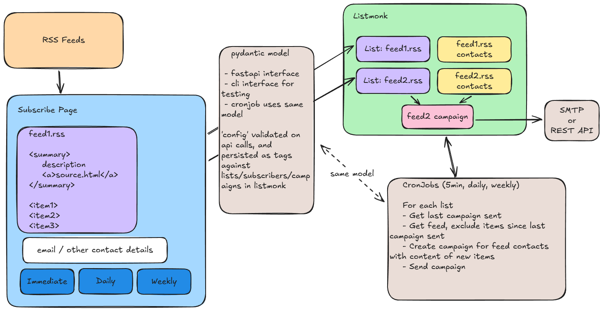

# rssmonk
A kustomize based deployment of [listmonk](https://github.com/knadh/listmonk) and k8s cronjobs to enable easy rss to email capabilities for large numbers of feeds/users.

Backlog:
- Basic services with listmonk/[everest (for postgres)](https://docs.percona.com/everest/index.html) on [minikube](https://minikube.sigs.k8s.io/docs/) with [traefik](https://doc.traefik.io/traefik/providers/kubernetes-gateway/)
- [HTML template](https://listmonk.app/docs/templating/#public-pages) for a subscribe page that can preview RSS cleanly
- [mailcatcher](https://github.com/sj26/mailcatcher) to debug campaigns
- Python based cronjob using [feedparser](https://feedparser.readthedocs.io/en/latest/) and [Last-Modified headers](https://feedparser.readthedocs.io/en/latest/http-etag.html) to reduce bandwidth of polling
- Sample configuration for double opt in & cron/[campaign](https://listmonk.app/docs/apis/campaigns/#get-apicampaignscampaign_id) generation based on [lists](https://listmonk.app/docs/apis/lists/#get-apilistslist_id)

## Usage

This repository should be discoverable and usable through it's [justfile](justfile).

## Diagram

Diagram source: [image.excalidraw](image.excalidraw)