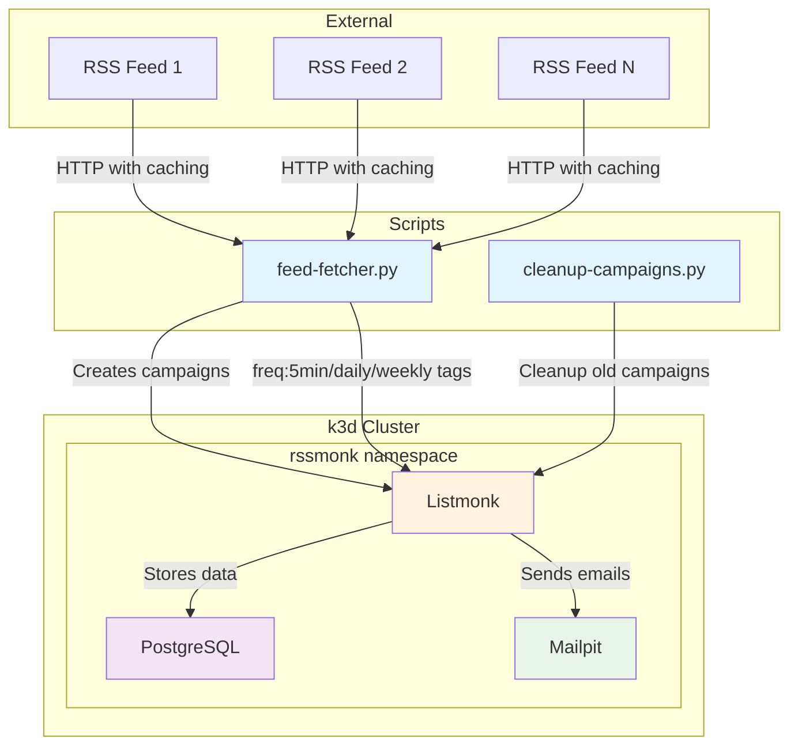

# RSS Monk

RSS-to-email service using [Listmonk](https://github.com/knadh/listmonk) with intelligent feed polling and HTTP caching.

_Parts of this project were coauthored with [Amp](https://ampcode.com)._

## Features

- **Smart Feed Management**: RSS feeds stored as Listmonk lists with frequency tags
- **HTTP Caching**: Efficient polling with ETag/Last-Modified headers
- **Frequency Control**: `freq:5min`, `freq:daily`, `freq:weekly` tag-based scheduling
- **Local Testing**: Complete k3d stack with Mailpit for email debugging

## Quick Start

```bash
just deploy-local  # Deploy complete stack to k3d
just simulate-cron 5min  # Test feed fetcher locally
```

Access services:
- **Listmonk**: `kubectl port-forward -n rssmonk svc/listmonk-service 9000:80`
- **Mailpit**: `kubectl port-forward -n rssmonk svc/mailpit 8025:8025`

## Architecture

**Stack**: k3d + PostgreSQL + Listmonk + Mailpit  
**Feeds**: Stored as Listmonk lists with frequency tags  
**Caching**: Hishel + feedparser for efficient HTTP requests  

## Commands

- `just deploy-local` - Deploy complete stack
- `just simulate-cron [5min|daily|weekly]` - Test feed fetcher  
- `just feed-manager <command>` - Manage RSS feeds and subscribers
- `just analyze` - Analyze codebase complexity
- `just setup-k3d` - Create k3d cluster

## Feed Management

```bash
# Quick setup: add feed + subscribe emails
just feed-manager quick-setup "https://hnrss.org/frontpage" daily user@example.com

# Individual commands
just feed-manager add-feed "https://feeds.feedburner.com/TechCrunch" 5min
just feed-manager add-subscriber user@example.com  
just feed-manager subscribe user@example.com 123
just feed-manager list-feeds
```

See [Feed Management Guide](docs/FEED_MANAGEMENT.md) for detailed REST API usage.

## Architecture Diagram




Diagram source: [image.excalidraw](image.excalidraw)
